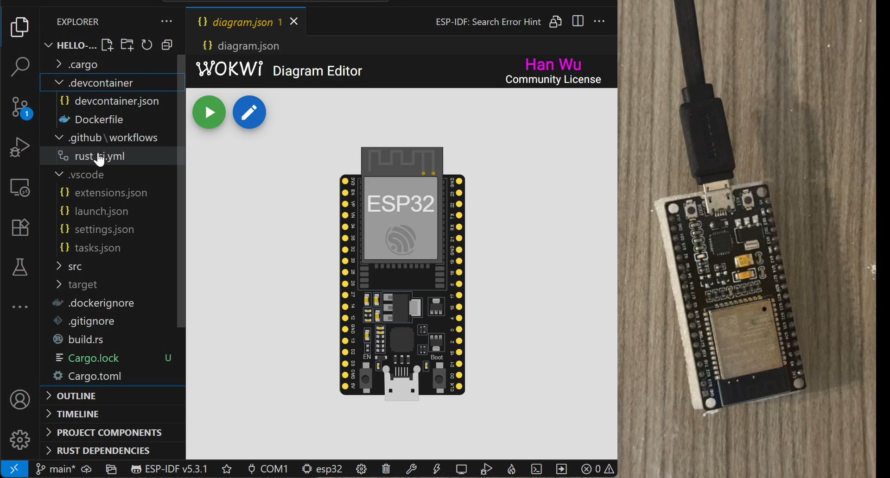

# ESP32 Rust (Xtensa LX6)

This project uses the original ESP32 (Xtensa LX6).

```bash
# Install toolchain
$ cargo install espup --locked
$ espup install

# Install project generation tool
$ cargo install esp-generate --locked

# Install the flash tool
$ cargo install espflash --locked
```


